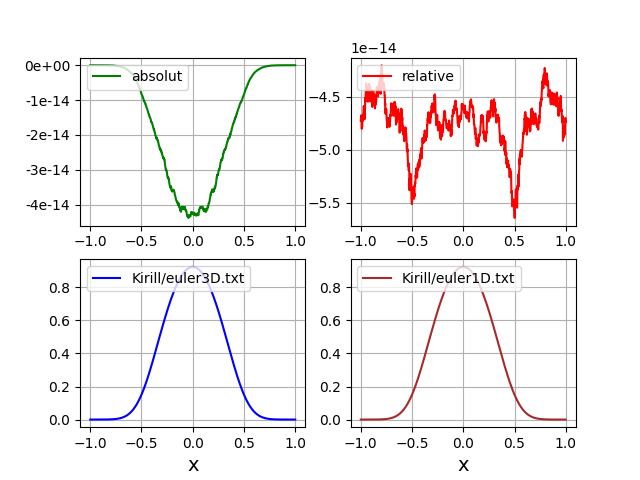
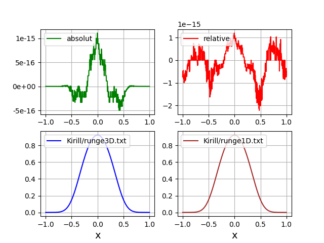
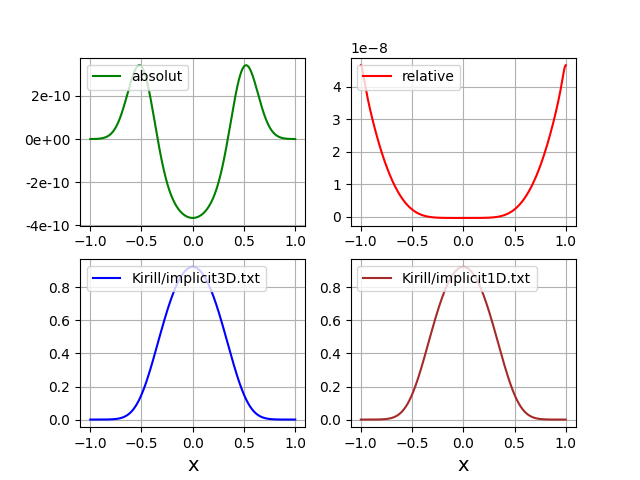

График распределение тепла за 80 нс на прямой X будет следующим:

**Сравнение полученных результатов с одномерным случаем распределения тепла стрежня**

* Явная разностная схема

* Метод Рунге-Кутта

* Неявная разностная схема

